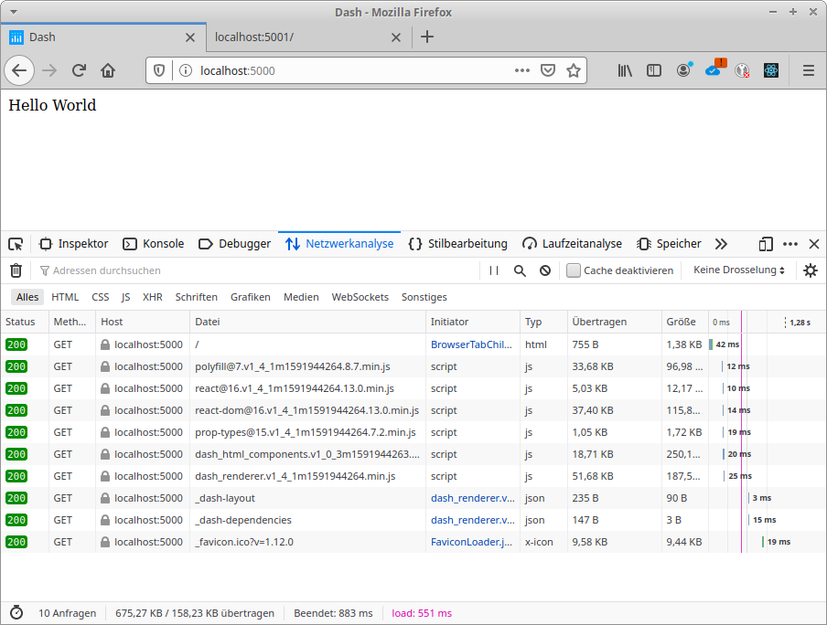
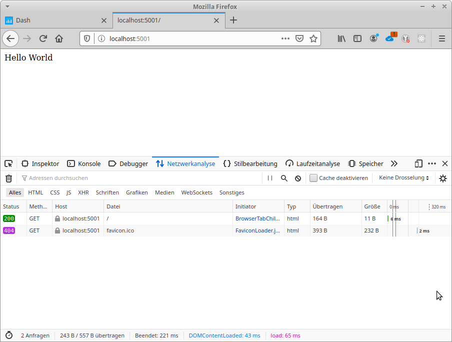
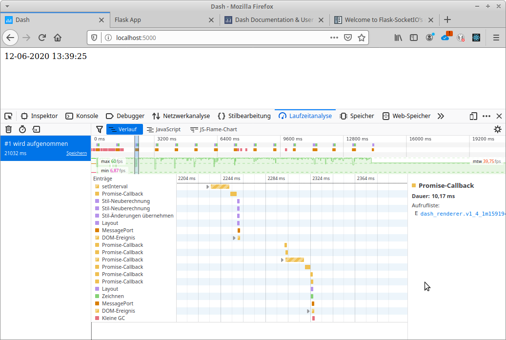
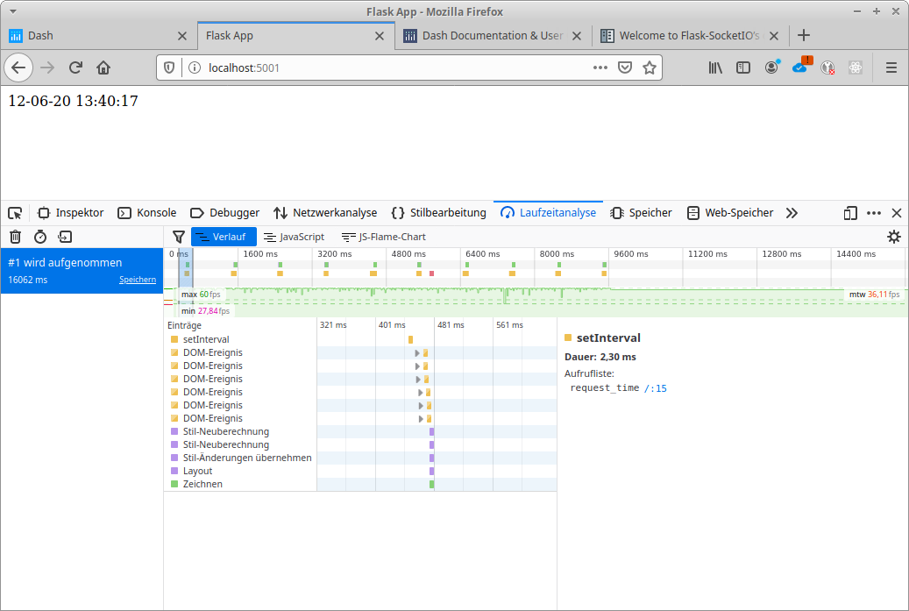

# Dash and Flask comparison

Metering notes:

* browser: Mozilla Firefox 

## 01 Hello World

Extremely simple webapp showing the text "Hello World".

**Dash App:**

**Flask App:**

Metering        |Dash               |Flask
----------------|-------------------|----------------------
request count   |10                 |2
size            |675kB              |243B
loading time    |551ms              |65ms
total time      |883ms              |221ms

## 02 Cyclic Refresh

**Dash App:**

**Flask App:**

Metering        |Dash               |Flask
----------------|-------------------|----------------------
request count   |12                 |2
size            |934kB              |979B
loading time    |615ms              |164ms
total time      |1.22s              |320ms
requests per update |1              |2
size of update data |221B           |206B + 195B
